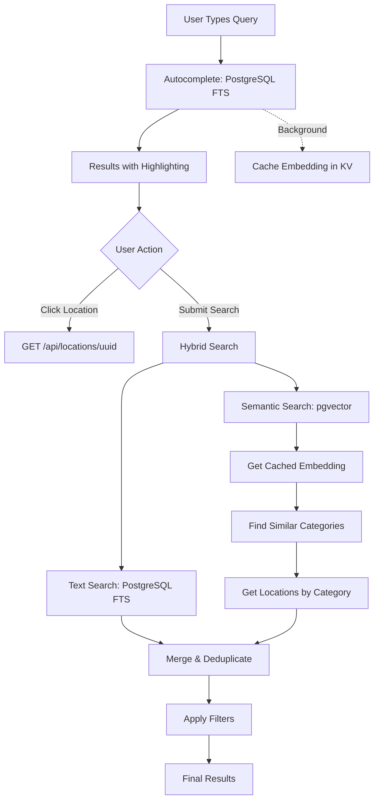

# Pay App - Crypto Payment Locations Map

A Nuxt 4 application for discovering locations that accept cryptocurrency payments in Lugano.

## Features

- 🗺️ Browse crypto-friendly locations with images and details
- 🔍 Hybrid search combining PostgreSQL FTS + semantic embeddings
- ⚡ Fast autocomplete with text search and background embedding precomputation
- 🎯 Category-based filtering and opening hours filtering
- 📍 Optional location-based search with Cloudflare IP geolocation
- 💾 PostgreSQL with PostGIS + pgvector for geospatial and semantic queries
- 🤖 OpenAI embeddings for intelligent category matching
- 🎨 UnoCSS with Nimiq design system (attributify mode)
- 🧩 Accessible UI with Reka UI components
- 🚀 Deployed on NuxtHub/Cloudflare

## Tech Stack

- **Framework**: Nuxt 4
- **Database**: PostgreSQL with PostGIS and pgvector extensions
- **ORM**: Drizzle ORM
- **AI**: OpenAI text-embedding-3-small for semantic search
- **Cache**: NuxtHub KV for embedding storage
- **Styling**: UnoCSS with `nimiq-css` and `unocss-preset-onmax`
- **UI Components**: Reka UI
- **Validation**: Valibot
- **Deployment**: NuxtHub/Cloudflare

## Installation

First, [install pnpm](https://pnpm.io/installation) if you haven't already.

```bash
# Install dependencies
pnpm install

# Set up environment variables
cp .env.example .env
# Edit .env with your PostgreSQL credentials

# Start PostgreSQL + PostGIS with Docker
pnpm run db:start
# Database is automatically seeded on first start
```

## Development

```bash
# Start development server
pnpm run dev
```

The app will be available at `http://localhost:3000`

**Note:** Make sure PostgreSQL with PostGIS is running and accessible with the credentials in your `.env` file.

## Project Structure

```
pay-app/
├── app/
│   ├── app.vue              # Root component
│   └── pages/
│       └── index.vue        # Main locations page with search
├── server/
│   ├── api/
│   │   ├── categories.get.ts           # Get all categories
│   │   ├── locations/
│   │   │   └── [uuid].get.ts          # Get single location by UUID
│   │   └── search/
│   │       ├── index.get.ts           # Hybrid search (text + semantic)
│   │       └── autocomplete.get.ts    # Fast text-only autocomplete
│   └── utils/
│       ├── drizzle.ts       # Database utilities and types
│       ├── geoip.ts         # GeoIP location service
│       ├── embeddings.ts    # OpenAI embedding generation with cache
│       ├── search.ts        # Search utilities (text, semantic, categories)
│       └── open-now.ts      # Opening hours filtering
├── shared/
│   └── types/
│       └── index.ts         # Shared TypeScript types
├── database/
│   ├── schema.ts            # Drizzle schema (3 tables, PostGIS + pgvector)
│   ├── docker-compose.yml   # Docker setup for PostgreSQL + PostGIS + pgvector
│   ├── init.sh              # Database initialization (PostGIS, pgvector, roles)
│   ├── run-migrations.sh    # Migration runner script
│   ├── rls-policies.sql     # Row Level Security policies
│   ├── seed.sql             # Main seed orchestration
│   ├── migrations/          # Drizzle migrations (auto-generated)
│   └── seeds/
│       ├── categories.sql   # All Google Maps categories with embeddings
│       └── sources/
│           └── dummy.sql    # Dummy location data
├── nuxt.config.ts           # Nuxt configuration
├── uno.config.ts            # UnoCSS configuration
├── drizzle.config.ts        # Drizzle ORM configuration
└── CLAUDE.md                # AI development guidance
```

## Search Flow

Hybrid search combining PostgreSQL full-text search with semantic category matching via vector embeddings.



**Key Points:**

- **Autocomplete**: PostgreSQL FTS only (fast, 10-50ms) + background embedding precomputation
- **Hybrid Search**: FTS + vector embeddings for comprehensive results
- **Embedding Cache**: NuxtHub KV with permanent storage (no TTL)
- **Text Search**: `to_tsvector` + `to_tsquery` with `ts_headline` highlighting on name and address
- **Semantic Search**: OpenAI text-embedding-3-small (1536-dim) + pgvector cosine similarity
- **Category Matching**: Similarity threshold 0.7 (configurable), returns top 5 similar categories
- **Merge Strategy**: Text results first, then semantic results (deduplicated by UUID)
- **Filters**: Category filters and opening hours filters applied after merge

## API Endpoints

### `GET /api/categories`

Returns all available categories from the database.

**Response:**
```typescript
Array<{
  id: string        // Category ID (e.g., "restaurant", "cafe")
  name: string      // Display name (e.g., "Restaurant", "Cafe")
  icon: string      // Icon identifier
}>
```

### `GET /api/locations/[uuid]`

Fetch a single location by UUID.

**Path Parameters:**
- `uuid`: Location UUID

**Response:**
```typescript
{
  uuid: string
  name: string
  address: string
  latitude: number
  longitude: number
  rating?: number
  photo?: string
  gmapsPlaceId: string
  gmapsUrl: string
  website?: string
  source: 'naka' | 'bluecode'
  timezone: string
  openingHours?: string
  categories: Array<{id: string, name: string, icon: string}>
  createdAt: Date
  updatedAt: Date
}
```

### `GET /api/search`

Hybrid search endpoint combining PostgreSQL FTS with semantic category matching.

**Query Parameters:**
- `q` (required): Search query
- `lat`/`lng` (optional): User location for future distance sorting
- `categories` (optional): Array of category IDs to filter by
- `openNow` (optional): Filter by opening hours (boolean)

**Response:**
```typescript
Array<{
  uuid: string
  name: string
  address: string
  latitude: number
  longitude: number
  rating?: number
  photo?: string
  gmapsPlaceId: string
  gmapsUrl: string
  website?: string
  source: 'naka' | 'bluecode'
  timezone: string
  openingHours?: string
  categoryIds: string  // Comma-separated category IDs
  categories: Array<{id: string, name: string, icon: string}>
  createdAt: Date
  updatedAt: Date
}>
```

### `GET /api/search/autocomplete`

Fast text-only search for autocomplete dropdown (PostgreSQL FTS only). Precomputes embeddings in background for future hybrid searches.

**Query Parameters:**
- `q` (required, min 2 chars): Search query

**Response:**
```typescript
Array<{
  // Same as /api/search response
  highlightedName: string  // HTML with <mark> tags highlighting matches
  // ... other fields
}>
```

## Database Schema

The database uses PostgreSQL with PostGIS and pgvector extensions, with a normalized relational schema:

### `categories`

Stores category types with vector embeddings for semantic search.

- `id` (text, PK): Category ID (e.g., "restaurant", "cafe")
- `name` (text): Display name (e.g., "Restaurant", "Cafe")
- `icon` (text): Icon identifier for UI
- `embedding` (vector(1536)): OpenAI text-embedding-3-small vector
- `createdAt` (timestamp): Creation timestamp

**Indexes:**
- Primary key on `id`
- Vector index for cosine similarity search on `embedding`

### `locations`

Main location data with PostGIS geometry and opening hours.

- `uuid` (text, PK): Auto-generated unique identifier
- `name` (text): Location name
- `address` (text): Full address
- `location` (geometry(point, 4326)): **PostGIS point** - Stores lat/lng as geographic point
- `rating` (double precision): User rating (0-5, optional)
- `photo` (text): Image URL (optional)
- `gmapsPlaceId` (text, unique): Google Maps Place ID
- `gmapsUrl` (text): Google Maps URL
- `website` (text): Location website (optional)
- `source` (varchar): Data source (`naka` or `bluecode`)
- `timezone` (text): IANA timezone identifier (e.g., "Europe/Zurich")
- `openingHours` (text): JSON string with weekly opening hours (optional)
- `createdAt`/`updatedAt` (timestamp): Timestamps

**Indexes:**
- Primary key on `uuid`
- Unique index on `gmapsPlaceId`
- GIST spatial index on `location` for efficient proximity queries

**PostGIS Functions:**
- Extract longitude: `ST_X(location)`
- Extract latitude: `ST_Y(location)`
- Calculate distance: `ST_Distance(location1, location2)`
- Find within area: `ST_Within(location, boundary)`

### `location_categories`

Junction table for many-to-many relationship between locations and categories.

- `locationUuid` (text, FK): Foreign key to locations.uuid (cascade delete)
- `categoryId` (text, FK): Foreign key to categories.id (cascade delete)
- `createdAt` (timestamp): Creation timestamp

**Indexes:**
- Composite primary key on (locationUuid, categoryId)
- Index on `locationUuid` for joins
- Index on `categoryId` for reverse lookups

## Scripts

```bash
# Development
pnpm run dev              # Start dev server
pnpm run build            # Build for production
pnpm run preview          # Preview production build

# Database
pnpm run db:start         # Start PostgreSQL + PostGIS with Docker
pnpm run db:stop          # Stop database
pnpm run db:restart       # Restart database (useful for reseeding)
pnpm run db:generate      # Generate migrations (stored in database/migrations/)

# Code Quality
pnpm run lint             # Run ESLint
pnpm run lint:fix         # Fix ESLint issues
pnpm run typecheck        # Run TypeScript checks
```

## Environment Variables

Create a `.env` file in the project root (see `.env.example`):

```env
# PostgreSQL Configuration
POSTGRES_HOST=localhost
POSTGRES_PORT=5432
POSTGRES_USER=postgres
POSTGRES_PASSWORD=your_password
POSTGRES_DB=postgres

# API Keys
NUXT_OPENAI_API_KEY=your_openai_api_key  # Required for semantic search
NUXT_GOOGLE_API_KEY=your_google_api_key

# JWT Configuration (if using Supabase Studio)
JWT_SECRET=your_jwt_secret
ANON_KEY=your_anon_key
SERVICE_ROLE_KEY=your_service_role_key

# Kong & Studio (optional)
KONG_HTTP_PORT=8100
STUDIO_PORT=4000
SUPABASE_PUBLIC_URL=http://localhost:8100
```

## Database Development

This repository includes a PostgreSQL + PostGIS + pgvector setup in the `database/` directory.

**Quick Start:**

```bash
pnpm run db:start      # Start services (PostgreSQL with PostGIS + pgvector)
```

**Access:**

- **Supabase Studio**: http://localhost:4000
- **PostgreSQL**: `localhost:5432`
- **REST API**: http://localhost:8100

**Extensions Enabled:**
- PostGIS (geospatial queries)
- pgvector (vector similarity search)

See [`database/README.md`](database/README.md) for PostGIS examples and REST API usage.

## Learn More

- [Nuxt Documentation](https://nuxt.com/docs)
- [NuxtHub Documentation](https://hub.nuxt.com/docs)
- [Drizzle ORM Documentation](https://orm.drizzle.team/docs/overview)
- [UnoCSS Documentation](https://unocss.dev/)
- [Nimiq CSS](https://github.com/onmax/nimiq-ui)
- [PostGIS Documentation](https://postgis.net/documentation/)

## License

MIT
