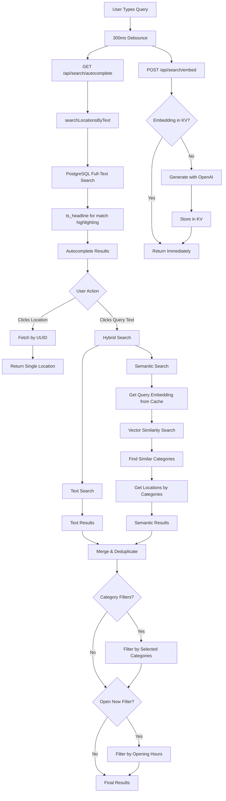

# Search Flow Documentation

This document explains the data flow for the hybrid search system combining full-text search with semantic category matching.

## Architecture Overview



## User Flow

### 1. Typing in Search Box

**What happens:**
- User types "coffee"
- After 300ms of inactivity (debounce), two parallel requests fire:
  1. **Autocomplete** (blocking) - shows dropdown immediately
  2. **Embedding precompute** (fire-and-forget) - caches for later

**Why debounce?**
- Prevents excessive API calls while user is still typing
- 300ms balances responsiveness with server load

**Code location:** `app/pages/index.vue:134-146`

### 2. Autocomplete Dropdown

**What happens:**
- `GET /api/search/autocomplete?q=coffee` returns 10 locations
- Uses PostgreSQL's `to_tsvector` and `to_tsquery` for fast text matching
- `ts_headline` wraps matches in `<mark>` tags for highlighting
- Dropdown shows:
  - User's query text (for semantic search)
  - Matching locations (for direct selection)

**Why only text search?**
- Vector embeddings are too slow (~200ms) for autocomplete
- Full-text search is fast enough (~10-50ms)

**Code location:** `server/api/search/autocomplete.get.ts:23-24`

### 3. Embedding Precompute (Background)

**What happens:**
- `POST /api/search/embed` with `{ q: "coffee" }`
- Endpoint immediately returns `{ ok: true }` without waiting
- Background: generates embedding and stores in NuxtHub KV
- Normalized key: `embedding:coffee` (lowercase, trimmed)

**Why fire-and-forget?**
- Doesn't block autocomplete response
- When user submits form, embedding is already cached
- Reduces form submission latency from ~200ms to ~10ms

**Code location:** `server/api/search/embed.post.ts:23-28`

### 4. User Clicks Query Text → Hybrid Search

**What happens:**
- `GET /api/search?q=coffee` triggers two parallel searches:
  1. **Text search** on location names/addresses
  2. **Semantic search** on category embeddings

**Text Search:**
```sql
WHERE to_tsvector('english', name || ' ' || address)
  @@ to_tsquery('english', 'coffee')
```

**Semantic Search:**
1. Get query embedding from KV cache (precomputed!)
2. Find similar categories using cosine distance:
   ```sql
   WHERE 1 - (embedding <=> query_embedding) >= 0.7
   ```
3. Return locations with those categories

**Merge Strategy:**
- Text results added first (higher priority)
- Semantic results added only if not already matched
- Preserves text match ordering while expanding coverage

**Why hybrid?**
- Text search: fast, exact matches ("Starbucks Coffee")
- Semantic search: finds related results ("cafe", "espresso bar")
- Together: comprehensive results without sacrificing speed

**Code location:** `server/api/search/index.get.ts:174-210`

### 5. User Clicks Location → Direct Fetch

**What happens:**
- `GET /api/search?uuid=abc-123`
- Single query fetches location + categories
- No text or semantic search needed

**Why separate path?**
- User already knows what they want
- Faster response (no search logic)
- Consistent result format for frontend

**Code location:** `server/api/search/index.get.ts:55-81`

## Data Flow Diagram

```
┌─────────────┐
│    User     │
└──────┬──────┘
       │ Types "coffee"
       ▼
┌──────────────────────┐
│  300ms Debounce      │
└─────────┬────────────┘
          │
    ┌─────┴─────┐
    │           │
    ▼           ▼
┌───────────┐ ┌──────────────┐
│Autocomplete│ │ Precompute   │
│  Request  │ │  Embedding   │
└─────┬─────┘ └──────┬───────┘
      │              │
      ▼              ▼
┌────────────┐ ┌──────────────┐
│PostgreSQL  │ │  Check KV    │
│Full-Text   │ │  Cache       │
│Search      │ └──────┬───────┘
└─────┬──────┘        │
      │          ┌────┴────┐
      │          │         │
      │          ▼         ▼
      │     ┌────────┐ ┌────────┐
      │     │ Hit    │ │ Miss   │
      │     │ Return │ │ OpenAI │
      │     └────────┘ └───┬────┘
      │                    │
      │                    ▼
      │              ┌──────────┐
      │              │Store in  │
      │              │KV Cache  │
      │              └──────────┘
      │
      ▼
┌────────────────┐
│Show Dropdown   │
│- "coffee"      │
│- Coffee Shop A │
│- Cafe B        │
└────────┬───────┘
         │
    ┌────┴─────┐
    │User      │
    │Clicks    │
    └────┬─────┘
         │
    ┌────┴────┐
    │         │
    ▼         ▼
┌────────┐ ┌──────────────┐
│Location│ │Query Text    │
│UUID    │ │(Semantic)    │
└───┬────┘ └──────┬───────┘
    │             │
    ▼             ▼
┌────────┐ ┌──────────────────┐
│Direct  │ │Hybrid Search:    │
│Fetch   │ │1. Text Search    │
│by UUID │ │2. Vector Search  │
└───┬────┘ │3. Merge Results  │
    │      └──────┬───────────┘
    │             │
    └─────┬───────┘
          │
          ▼
    ┌──────────────┐
    │Apply Filters:│
    │- Categories  │
    │- Open Now    │
    └──────┬───────┘
           │
           ▼
    ┌──────────────┐
    │Display Grid  │
    │of Locations  │
    └──────────────┘
```

## Performance Optimizations

### 1. KV Cache for Embeddings

**Why:** OpenAI API calls are slow (~200ms) and expensive ($0.0001/1K tokens)

**Strategy:**
- Permanent cache (no TTL) - embeddings never change
- Normalized keys (lowercase, trimmed) - maximizes cache hits
- Precompute during typing - cache hit rate near 100% on form submission

**Impact:**
- Form submission: 200ms → 10ms
- Cost savings: ~90% fewer API calls

### 2. Debounced Autocomplete

**Why:** Prevents API spam while user types

**Strategy:**
- 300ms delay after last keystroke
- Two parallel requests (autocomplete + precompute)
- Non-blocking precompute (fire-and-forget)

**Impact:**
- "coffee shop" = 2 autocomplete requests instead of 11
- User still sees results quickly (text search is fast)

### 3. PostgreSQL Built-in FTS

**Why:** Faster than vector search for exact/prefix matches

**Strategy:**
- Autocomplete uses only FTS (fast path)
- Hybrid search uses FTS + vectors (comprehensive results)
- `ts_headline` for native highlighting (no client-side regex)

**Impact:**
- Autocomplete: 10-50ms response time
- No need for separate search index (Algolia, Elasticsearch, etc.)

### 4. Reusable locationSelect Helper

**Why:** Avoid duplicating 20+ lines of SELECT columns

**Strategy:**
- Single object with all location fields
- Spread into queries: `select({ ...locationSelect })`
- PostGIS functions: `ST_Y(location)` for latitude

**Impact:**
- DRY code - single source of truth
- Easier to add/remove fields

**Code location:** `server/utils/search.ts:7-24`

## Database Schema

### Embeddings Storage

```sql
-- Category embeddings for semantic search
CREATE TABLE categories (
  id TEXT PRIMARY KEY,
  name TEXT NOT NULL,
  icon TEXT,
  embedding VECTOR(1536),  -- OpenAI text-embedding-3-small
  created_at TIMESTAMP DEFAULT NOW()
);

-- Index for fast vector similarity search
CREATE INDEX categories_embedding_idx
  ON categories
  USING ivfflat (embedding vector_cosine_ops);
```

### Full-Text Search Index

```sql
-- Automatically maintained by PostgreSQL
-- Applied on: to_tsvector('english', name || ' ' || address)
```

## Why This Architecture?

### Trade-offs Made

**Speed vs. Intelligence:**
- Autocomplete: Pure text search (fast, less smart)
- Form submission: Hybrid search (slower, more comprehensive)
- Users get fast feedback, then better results

**Caching Strategy:**
- Permanent embedding cache (simple, effective)
- No TTL management needed
- Embeddings are deterministic (same input = same output)

**API Design:**
- Separate autocomplete endpoint (optimized for speed)
- Single search endpoint (handles UUID + hybrid search)
- Embed endpoint for background precompute

**Frontend State:**
- URL params for filters (shareable links)
- selectedLocation distinguishes UUID vs. query search
- Autocomplete shows query text + locations (dual purpose)

### Future Improvements

1. **Distance-based sorting:** Use lat/lng for proximity ranking
2. **Personalization:** Cache user preferences, recent searches
3. **Fuzzy matching:** Handle typos in autocomplete
4. **Multi-language:** Support non-English queries and locations
5. **Category embeddings refresh:** Periodically update with new categories

## Error Handling

### Graceful Degradation

- Embedding precompute fails → Silent, search still works (just slower)
- Geolocation fails → Search works without user location
- Vector search fails → Fall back to text search only
- Opening hours parse fails → Show "Hours unavailable"

### User Experience

- No error messages for background failures
- Search always returns results (random if no query)
- Autocomplete shows query text even with 0 location matches
- Filters can be removed individually

## Code Organization

```
app/pages/index.vue                    # Frontend search UI
server/api/search/
  ├── index.get.ts                     # Main search (hybrid)
  ├── autocomplete.get.ts              # Fast text-only search
  └── embed.post.ts                    # Background precompute
server/utils/
  ├── search.ts                        # Search helpers
  │   ├── locationSelect               # Reusable SELECT object
  │   ├── searchLocationsByText()      # PostgreSQL FTS
  │   ├── searchSimilarCategories()    # Vector similarity
  │   └── searchLocationsByCategories()# Category-based fetch
  └── embeddings.ts                    # OpenAI integration
      ├── generateEmbedding()          # AI SDK wrapper
      └── generateEmbeddingCached()    # KV cache layer
```

## Key Technologies

- **PostgreSQL Full-Text Search:** Built-in `to_tsvector`, `to_tsquery`, `ts_headline`
- **pgvector:** Cosine distance operator `<=>` for similarity search
- **OpenAI text-embedding-3-small:** 1536-dimensional embeddings
- **NuxtHub KV:** Cloudflare KV-backed cache for embeddings
- **AI SDK:** Vercel's SDK for LLM/embedding operations
- **Drizzle ORM:** Type-safe PostgreSQL queries
